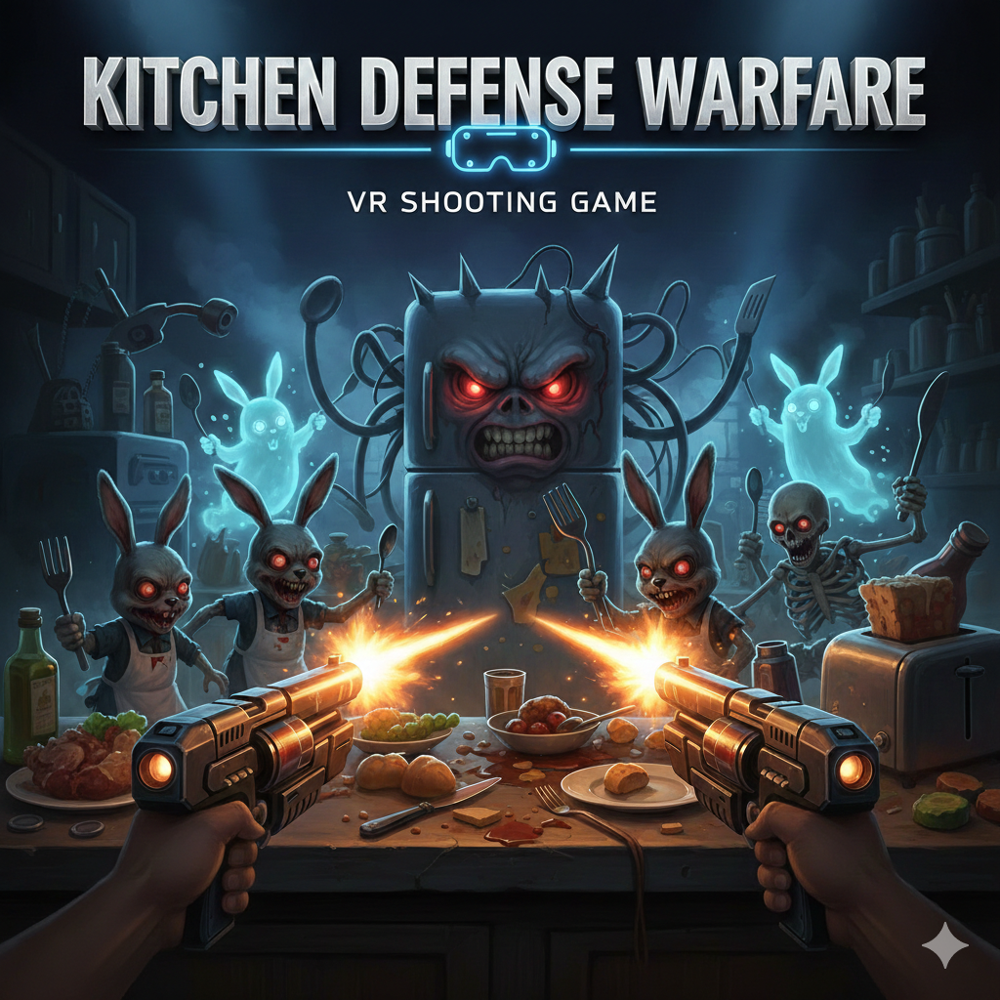

# 🧑‍🍳 VR Kitchen Defense Warfare

*A Meta Quest VR wave-based shooter built with Unity 6000.3*



---

## 📌 Project Overview

**VR Kitchen Defense Warfare** is a room-scale VR wave-based defense game developed with **Unity 6000.3** and **XR Interaction Toolkit**, targeting **Meta Quest** devices.

The player stands inside a kitchen and defends a front desk against incoming monsters.  
Enemies spawn from multiple locations, navigate intelligently using NavMesh, and attempt to reach the target desk.  
The player grabs different food-themed weapons and eliminates enemies before losing all health.

---

## 🎮 Core Gameplay

### Player
- Starts with **10 HP**
- Loses **1 HP** when a monster reaches the front desk
- Uses VR controllers to:
  - Grab weapons
  - Shoot enemies
  - Pause / resume the game

---

### Weapons

| Weapon | Fire Rate | Damage | Special |
|------|----------|--------|--------|
| 🥚 Egg Gun | Fast | Low | Single target |
| 🍅 Tomato Gun | Medium | Medium | Balanced |
| 🍉 Watermelon Gun | Slow | High | Area damage |

- Weapons are grabbed via **XR Grab Interactable**
- Guns attach naturally to the hand
- Bullets are physics-based
- Gun and bullet collisions are separated using **Layer Collision Matrix**

---

### Enemies
- **4 different monster types**
- Each monster:
  - Has **100 HP**
  - Uses **NavMeshAgent** for obstacle-aware navigation
- Monsters spawn from **3 different spawn points**
- Spawn system includes:
  - Random monster selection
  - Spawn-point occupancy checks (prevents overlapping)

---

### Waves

| Wave | Enemy Count |
|-----|-------------|
| 1 | 15 |
| 2 | 20 |
| 3 | 30 |

- Game ends when:
  - All waves are cleared → **Victory**
  - Player HP reaches 0 → **Failure**

---

## 🧭 Enemy Navigation

Enemies use **Unity NavMesh** for optimized pathfinding:

- `NavMeshSurface` baked on kitchen floor
- `NavMeshAgent` on each monster
- Dynamic repathing toward a target empty GameObject
- Automatically avoids:
  - Tables
  - Walls
  - Doorways
- Stable indoor navigation without jitter

---

## 🖥️ UI & Scene Flow

### Scenes

| Scene Name | Description |
|----------|------------|
| `MainMenu` | Start / Quit |
| `GameScene` | Main gameplay |
| `ResultScene` | Win / Lose summary |

---

### UI Flow

```
MainMenu
   ↓ Start
GameScene
   ↓ Win / Lose
ResultScene
   ↙ Restart   ↘ Main Menu
```


---

## 🛠️ Technologies Used

- **Unity 6000.3**
- **XR Interaction Toolkit**
- **Input System (New)**
- **NavMesh / NavMeshAgent**
- **Meta Quest SDK**
- **World Space XR UI**

---

## ✅ Solved Technical Challenges

- XR UI interaction via controller ray
- Stable grab & drop behavior (State-based selection)
- Trigger-based shooting using Input System
- Gun & bullet collision isolation
- Random monster spawning without overlap
- Reliable NavMesh-based enemy navigation
- Menu button pause without UI dependency
- Scene switching with safe timeScale handling
- Unity Inspector/Layout recovery during development

---

## 🚀 Future Improvements

- Boss enemies
- Weapon upgrades
- Spatial sound effects
- Difficulty scaling
- Visual damage feedback
- Monster and weapon animations
